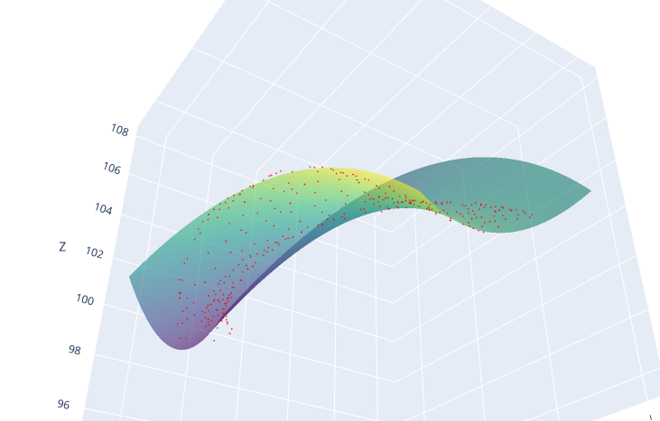
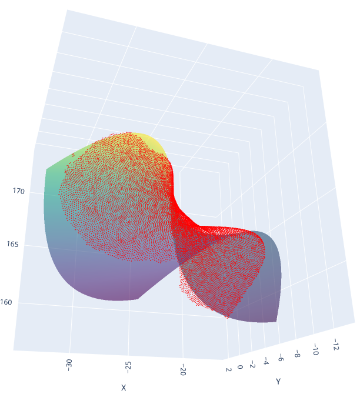

# Quadric_Anthro

This repository provides tools for fitting quadratic surfaces to 3D anthropological surfaces (such as bone surfaces) using Python. The core functionality includes fitting, visualizing, and extracting relevant geometric information from these surfaces, with an emphasis on handling rotated quadratic shapes.

## Repository Structure

- **kappa/**: Contains the main modules used for fitting quadrics and performing rotations.
- **scripts/**: Top-level scripts for fitting quadratic surfaces to 3D points and saving the results to JSON format. Includes CLI tools for fitting surfaces and visualizing the results.

## Features

- **Quadratic Surface Fitting**: Fit quadratic surfaces to 3D points from bone scans or other anthropological data.
- **Rotation and Translation**: Handle surfaces in rotated and translated frames of reference.
- **Principal Curvature Calculation**: Compute key geometric features like principal curvatures, Gaussian curvature, and mean curvature.
- **3D Visualization**: Visualize the fitted quadratic surface alongside the input points using Plotly.

## Installation

~~~bash
git clone https://github.com/yourusername/quadric_anthro.git
cd quadric_anthro
pip install -r requirements.txt
~~~

Make sure you have Python 3.11+ installed. You can install dependencies using `requirements.txt`.

## Usage

### Fitting a Quadratic Surface from CSV

You can use the provided script to fit a quadratic surface to 3D points stored in a CSV file.

~~~bash
python scripts/fit_quadratic.py path/to/input.csv --show-plot
~~~

This will:
- Fit a quadratic surface to the points in the CSV file.
- Optionally show a 3D plot of the fitted surface and the original points using Plotly.

Your CSV file should have column headers named `X` `Y` and `Z`. You can also have other colmns but they will be ignored. 

For example:
```csv
X,Y,Z
-19.426216,-4.421572,158.221329
-19.44153,-4.292467,158.191696
-19.409149,-4.644158,158.363998
-19.42835,-4.483474,158.353073
-19.451342,-4.291779,158.35025
-19.472319,-4.121542,158.33989
-19.486069,-3.997751,158.40181
....
```

### Output

The script will generate a JSON file containing:
- The fitted quadratic coefficients.
- Principal curvatures (k1, k2), mean curvature, and Gaussian curvature.
- Rotation and translation parameters of the surface.

The JSON file will be saved with the same name as the input CSV, replacing the `.csv` extension with `.json`.

### Example

~~~bash
python scripts/fit_quadratic.py sample_data/bone_points.csv --show-plot
~~~

This will fit a quadratic surface to the 3D points in `bone_points.csv` and display a 3D plot (in your browser)

## Visualization

The fitted surface and original points can be visualized interactively using Plotly. If the `--show-plot` flag is provided, the 3D surface and points will be displayed in an interactive plot window.





